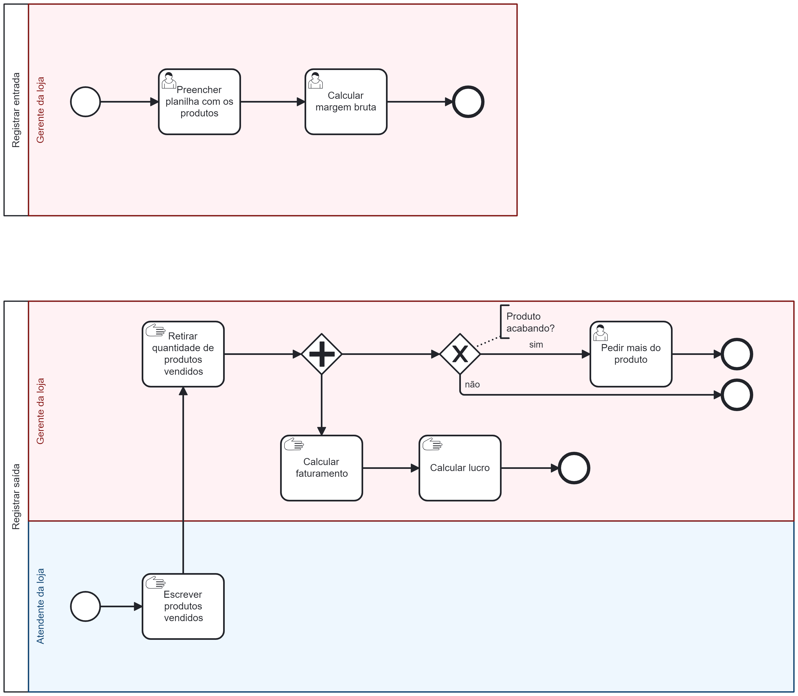

# Relatório As-IS

- Processos

## Processo de Registrar Entrada

A gestora preenche a panilha com os produtos e calcula a margem burta.

## Processo de registrar saída

Na loja, onde não há um sistema informatizado, o processo de gerenciamento de vendas e estoque é feito de forma manual. Aqui está uma explicação dos passos envolvidos:

Registro de Produtos Vendidos:

O marido da gestora registra manualmente os produtos vendidos em um papel sempre que ocorre uma venda na loja. Ele anota o nome do produto e a quantidade vendida.
Determinação da Quantidade de Produtos Vendidos:

Periodicamente, a gestora revisa esses registros para determinar a quantidade de cada produto vendido durante um determinado período de tempo. Isso pode ser feito através da contagem dos registros de vendas ou por meio de um cálculo a partir dos registros.

Cálculo do Faturamento:

Com a quantidade de produtos vendidos em mãos, a gestora calcula o faturamento total da loja. Para isso, ela multiplica a quantidade vendida de cada produto pelo seu preço de venda individual e depois soma todos os valores.

Cálculo do Lucro:

Além do faturamento, a gestora também calcula o lucro obtido com as vendas. Ela subtrai o preço de custo do preço de venda de cada produto para determinar o lucro unitário. Em seguida, multiplica o lucro unitário pelo número de unidades vendidas e soma os lucros de todos os produtos.

Reposição de Estoque:

Se a gestora perceber que algum produto está acabando ou com baixo estoque, ela toma a iniciativa de fazer um pedido de reposição imediato. Isso é crucial para garantir que a loja tenha sempre produtos disponíveis para os clientes.
