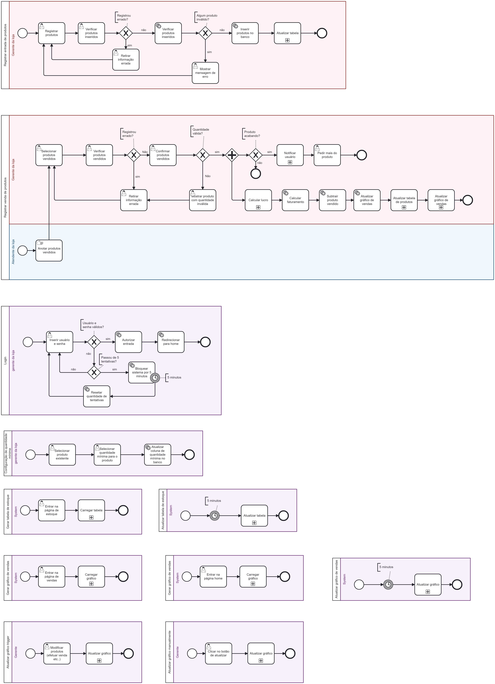

# Relatório To-Be

- Processos

##  Registrar entrada de produtos
> Quando chegam novos produtos, a gestora da loja poderá acessar a parte do Sistema de Entrada de Produtos. Ela escreverá qual produto foi comprado. Se o produto já existir, ela apenas inserirá a quantidade. Caso contrário, ela adicionará o produto juntamente com as quantidades compradas. Em seguida, a gestora verifica se está registrando os produtos corretos. Se houver algum erro, ela retira a informação incorreta e refaz o registro. Quando feito corretamente, são verificadas as quantidades dos produtos registrados para detectar possíveis erros ou produtos inválidos. Se alguma informação for inválida, uma mensagem de erro é exibida e o processo retorna ao registro inicial dos produtos. Se estiver tudo correto, o produto é inserido no banco de dados e, em seguida, na tabela.

## Login

> A gerente da loja irá inserir o usuário e a senha, se não for válido a gerente terá mais 4 tentativas para acessar, se passar de 5 tentativas e errar em todas, o sistema será bloqueado por 5 minutos depois dos 5 minutos ela poderá tentar novamente com as 5 tentativas, se as informações de usuário e senha forem inseridos corretamente será autorizado a entrada e então a gestora será redirecionada para a página principal.

## Configuração de quantidade mínima

> A gerente irá escolher o produto e define a quantidade mínima desejada, então o sistema automaticamente atualiza a coluna de quantidade mínima no banco de dados.

## Gerar Tabela de estoque

> Quando a gerente acessar a página de estoque, o sistema carrega a tabela automaticamente.

## Gerar gráfico de vendas
>Assim que o gestor acessa a página inicial do sistema, um gráfico financeiro é automaticamente criado, exibindo todas as atualizações financeiras realizadas.

## Atualizar gráfico trigger
>Após a atualização manual das finanças, o algoritmo irá extrair as informações do banco de dados e, em seguida, atualizará o gráfico automaticamente com base nos dados atualizados.

## Atualizar gráfico manualemnte
>Após o registro das finanças, o sistema irá calcular as entradas e saídas, e quando a gestora retornar à página inicial, o gráfico será atualizado automaticamente para refletir essas informações.

## Registrar venda de produtos

> Conforme descrito no processo AS-IS, o marido da gestora registra manualmente os produtos vendidos em um papel sempre que ocorre uma venda na loja. Ele anota o nome do produto e a quantidade vendida. Uma vez que as vendas do dia são registradas, o papel é repassado para a gestora. Ao entrar no sistema, ela pode selecionar quais produtos foram vendidos e verificar se as informações estão corretas. Se necessário, ela pode corrigir o registro. Quando tudo está correto, ela confirma o registro dos produtos.

Em seguida, é verificado se a quantidade vendida é válida. Se não for, o produto com quantidade inválida é mostrado e o processo retorna à etapa de registro do produto. Se estiver tudo correto, é verificado se algum produto vendido está acabando. Se não houver escassez, nenhum procedimento adicional é realizado. No entanto, se houver escassez, a gestora é notificada e pode fazer novos pedidos dos produtos necessários.

Além da verificação do estoque, o lucro líquido e o faturamento são calculados. Se o pagamento do cliente for feito no cartão, há um subprocesso adicional que envolve o cálculo da taxa da maquininha da loja. A fórmula para calcular o lucro liquido é: lucro liquido = (Preço vendido - Preço comprado - preço do transporte - preço da máquina, caso seja comprado no cartão). Os produtos vendidos são subtraídos do estoque e o gráfico de vendas é atualizado. A tabela de produtos também é atualizada. Após isso, o gráfico de vendas é atualizado novamente para refletir as últimas transações.