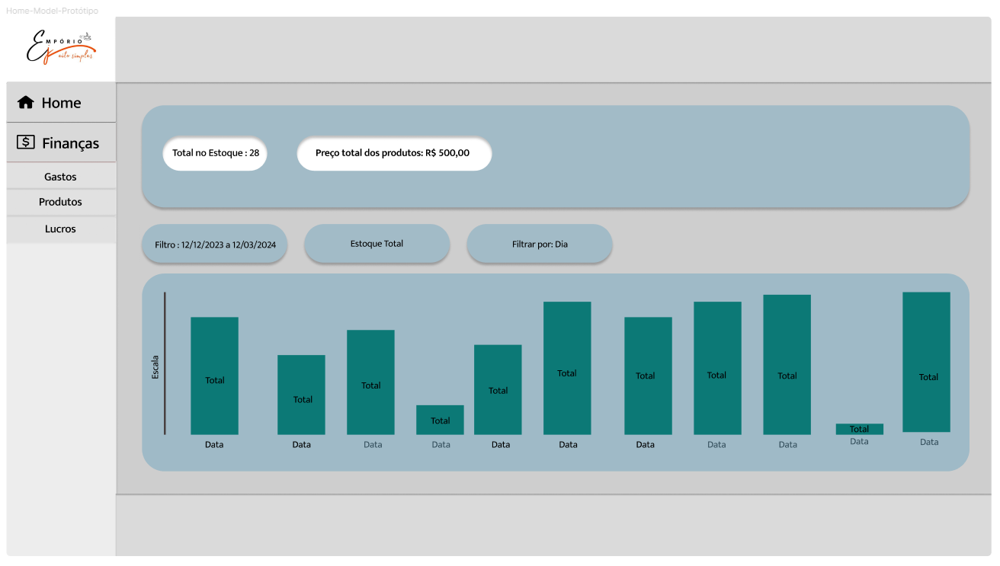

# Informações do Projeto

Sistema de Gerenciamento da Loja Empório Jeito Simples

# Curso

Sistemas de Informação

## Participantes

- Abner Mateus de Oliveira Santos 
- Hadassa Brenda Souza Santos 
- Igor Lucas Assunção Ribas 
- Pedro Henrique Marques Simões 
- Victor de Castro Nakabayashi

# Estrutura do Documento

- [Informações do Projeto](#informações-do-projeto)
  - [Participantes](#participantes)
- [Estrutura do Documento](#estrutura-do-documento)
- [Introdução](#introdução)
  - [Problema](#problema)
  - [Objetivos](#objetivos)
  - [Justificativa](#justificativa)
  - [Público-Alvo](#público-alvo)
- [Especificações do Projeto](#especificações-do-projeto)
  - [Personas e Mapas de Empatia](#personas-e-mapas-de-empatia)
  - [Histórias de Usuários](#histórias-de-usuários)
  - [Requisitos](#requisitos)
    - [Requisitos Funcionais](#requisitos-funcionais)
    - [Requisitos não Funcionais](#requisitos-não-funcionais)
  - [Restrições](#restrições)
- [Projeto de Interface](#projeto-de-interface)
  - [User Flow](#user-flow)
  - [Wireframes](#wireframes)
- [Metodologia](#metodologia)
  - [Divisão de Papéis](#divisão-de-papéis)
  - [Ferramentas](#ferramentas)
  - [Controle de Versão](#controle-de-versão)
- [**############## SPRINT 1 ACABA AQUI #############**](#-sprint-1-acaba-aqui-)
- [Projeto da Solução](#projeto-da-solução)
  - [Tecnologias Utilizadas](#tecnologias-utilizadas)
  - [Arquitetura da solução](#arquitetura-da-solução)
- [Avaliação da Aplicação](#avaliação-da-aplicação)
  - [Plano de Testes](#plano-de-testes)
  - [Ferramentas de Testes (Opcional)](#ferramentas-de-testes-opcional)
  - [Registros de Testes](#registros-de-testes)
- [Referências](#referências)

# Introdução

## Problema

Apesar dos avanços tecnológicos, é notável que muitas empresas ainda recorrem a métodos antiquados, como o uso excessivo do Excel, para realizar tarefas simples do dia a dia. Isso resulta em processos lentos, suscetíveis a erros e dificuldades na gestão de dados. A falta de integração e automação desses sistemas pode acarretar desperdício de tempo e recursos, limitando a capacidade da empresa de acompanhar o ritmo competitivo do mercado. Diante desse cenário, torna-se evidente a necessidade premente de implementar um sistema gerencial eficiente para que a empresa possa alcançar seu máximo potencial no mercado.

## Objetivos
Objetivo Geral: O objetivo geral do trabalho é desenvolver um sistema de gestão financeira para a empresa, de forma que ela tenha um melhor controle sobre seus custos e lucros. O sistema deve permitir que a empresa faça o acompanhamento de suas receitas e despesas, bem como a análise de seus resultados financeiros.
Objetivos específicos: O principal objetivo é desenvolver um sistema que permita o registro de receitas e despesas da empresa e a análise de resultados financeiros.
## Justificativa

O tema foi escolhido devido à necessidade evidente da empresa em melhorar sua eficiência operacional e competitividade no mercado. O uso de processos manuais, especialmente na gestão de vendas, margem de lucro e controle de gastos fixos, tem se mostrado inadequado diante das demandas atuais do mercado. Portanto, a implementação de um software para automatizar esses processos é crucial para otimizar o desempenho da empresa.
A função do projeto é desenvolver um software que simplifique e agilize as operações da empresa, especialmente nas áreas de vendas, margem de lucro e controle de gastos fixos. O software terá funcionalidades para facilitar o registro de vendas, análise da margem de lucro e acompanhamento dos gastos fixos. Essa solução visa aumentar a eficiência operacional, minimizar erros e proporcionar uma experiência mais fluida tanto para os funcionários quanto para os clientes.
O público-alvo da obra são empresas de médio porte que enfrentam desafios similares em relação à gestão de vendas, margem de lucro e controle de gastos fixos. Especificamente, gestores e funcionários envolvidos na operação diária da empresa, são o público principal que se beneficiará da solução proposta. O trabalho está baseado em uma análise cuidadosa dos processos atuais da empresa, bem como em estudos de mercado e tendências tecnológicas relevantes para o desenvolvimento do software. Além disso, serão realizadas consultas a fontes confiáveis, como artigos acadêmicos, relatórios de mercado, para embasar as decisões de design e desenvolvimento do software.

## Público-Alvo

O público-alvo é a empresa Empório Jeito Simples. Empresas de pequeno porte como essa geralmente não possuem qualquer método adequado, e acabam por usar o Excel por exemplo que é bem lento, normalmente também não possuem o conhecimento de como criar um sistema/software que consiga ajuda-los. A hierarquia não é bem definida já que a empresa é familiar, mas possui uma gestora e é ela com quem precisamos mais nos comunicar.

# Especificações do Projeto

As especificações deste projeto fornecem uma visão abrangente dos requisitos e expectativas para o sistema a ser desenvolvido. O escopo do projeto inclui o desenvolvimento de várias funcionalidades principais, cada uma projetada para melhorar a experiência do usuário e aumentar a eficiência operacional.

No entanto, certas funcionalidades e características estão fora do escopo deste projeto eserão consideradas para desenvolvimento futuro.
Os requisitos funcionais do sistema detalham as operações específicas que o sistema deve realizar. Isso inclui a capacidade de os usuários interagirem com o sistema de várias maneiras para alcançar seus objetivos.

Os requisitos não funcionais, por outro lado, se concentram na qualidade geral do sistema, incluindo seu desempenho, segurança e usabilidade.
Do ponto de vista técnico, o sistema será construído usando tecnologias modernas e confiáveis para garantir a robustez e a escalabilidade. Também seguiremos as melhores práticas de codificação e padrões da indústria durante todo o processo de desenvolvimento.

## Personas e Mapas de Empatia

> **PersonaS** > 
>
> 
>
> 
>
> **MAPAS DE EMPATIA** > 
>
> 
>
> 

## Histórias de Usuários

Com base na análise das personas foram identificadas as seguintes histórias de usuários:

| EU COMO... `PERSONA` | QUERO/PRECISO ... `FUNCIONALIDADE`                          | PARA ... `MOTIVO/VALOR`                                                                                        |
| -------------------- | ----------------------------------------------------------- | -------------------------------------------------------------------------------------------------------------- |
| Administradora       | Sistema de login                                            | Para proteger os dados do meu negócio                                                                          |
| Administradora       | Gerenciar estoque e finanças em um sistema digital          | acilitar a gestão da loja, ter acesso rápido às informações e evitar erros de registro manual                  |
| Atendente            | Visualizar relatório de vendas diárias e estoque atualizado | Tomar decisões estratégicas com base nas informações atualizadas e evitar falta ou excesso de produtos na loja |
| Atendente            | Registrar vendas e atualizar estoque                        | Controlar as vendas diárias e manter o controle financeiro e de estoque da loja atualizados                    |
| Atendente            | Registrar vendas e atualizar estoque                        | Controlar as vendas diárias e manter o controle financeiro e de estoque da loja atualizados                    |

## Requisitos

As tabelas que se seguem apresentam os requisitos funcionais e não funcionais que detalham o escopo do projeto.

### Requisitos Funcionais

| ID       | Descrição do Requisito                                                                   | Prioridade |
| -------- | ---------------------------------------------------------------------------------------- | ---------- |
| RF - 001 | O sistema deve permitir que os usuários registrem vendas, margem de lucro e gastos fixos | Alta       |
| RF - 002 | Permitir atualizações das vendas, margem de lucro e gastos fixos                         | Alta       |

### Requisitos não Funcionais

| ID      | Descrição do Requisito                                                                                                                      | Prioridade |
| ------- | ------------------------------------------------------------------------------------------------------------------------------------------- | ---------- |
| RNF-001 | A interface do usuário deve ser intuitiva e fácil de usar, permitindo que os usuários realizem operações de forma rápida e sem dificuldades | Alta       |
| RNF-002 | Deve ser responsivo para rodar em dispositivos móveis                                                                                       | Média      |
| RNF-003 | O sistema deve ser capaz de lidar volume de dados sem comprometer o desempenho                                                              | Baixa      |

## Restrições

O projeto está restrito pelos itens apresentados na tabela a seguir.

| ID  | Restrição                                             |
| --- | ----------------------------------------------------- |
| 01  | O projeto deverá ser entregue até o final do semestre |
| 02  | Não pode ser desenvolvido um módulo de backend        |

# Projeto de Interface

## User Flow

## Wireframes

# Metodologia

O grupo adotou as metodologias ágeis Scrum (para divisão de funções) e Kanban (para divisão de tarefas).
A equipe foi dividida em: 1 Product Owner, 1 Scrum Master, 1 Designer, 2 Desenvolvedores Líderes e 3 desenvolvedores.
Para a divisão de tarefas, foi criada uma área de trabalho baseada num template pré-definido no Trello, com as colunas “Recursos para Projetos”, “Perguntas para a Próxima Reunião”, “A fazer”, “Pendente”, “Bloqueio” e “Concluído”.

## Divisão de Papéis

Product Owner (PO): Hadassa

Scrum Master (SM): Abner

Designer: Igor

Desenvolvedores Líderes (DL): Abner e Igor

Desenvolvedores (Devs): Hadassa, Pedro e Victor

## Ferramentas

| Ambiente                               | Plataforma                              | Link de Acesso                                                                 |
| -------------------------------------- | --------------------------------------- | ------------------------------------------------------------------------------ |
| Editor de Código                       | Visual Studio Code e Visual Studio 2022 | https://code.visualstudio.com/ https://visualstudio.microsoft.com/pt-br/vs/    |
| Gerenciador de Versionamento do Código | GitHub                                  | https://github.com/PSG-TIAPN-2022-1/psg-tiapn-2024-1-hapiv-team                |
| Ferramenta de Metodologia Ágil         | Trello                                  | https://trello.com/b/DIofQd7U/gerenciamento-da-loja-emp%C3%B3rio-jeito-simples |
| Ferramenta de Design                   | Figma                                   | https://www.figma.com/                                                         |
| Ferramentas de Comunicação             | Whatsapp, Teams e Google Meet           |                                                                                |

Os editores de código VsCode e Visual Studio 2022 foram escolhidos pela afinidade que os integrantes do grupo já possuem com as plataformas.
O Github foi selecionado como gerenciador de versionamento do código por possuir uma interface amigável, além de oferecer múltiplas funcionalidades de visualização das alterações no código.
Como ferramenta de metologia ágil, será utilizada a plataforma Trello, por ser fácil para implementar e visualizar o Scrum/Kanban do projeto.
Para design da solução proposta, foi selecionada a plataforma Figma, por ter várias opções de confecção de UI (User Interface), Wireframes, etc.
Além disso, para comunicação, estão sendo utilizados o Whatsapp e Teams para comunicação interna do grupo e Google Meet para reuniões com o cliente.

## Controle de Versão

...... COLOQUE AQUI O SEU TEXTO ......

> Discuta como a configuração do projeto foi feita na ferramenta de
> versionamento escolhida. Exponha como a gerência de tags, merges,
> commits e branchs é realizada. Discuta como a gerência de issues foi
> realizada.
> A ferramenta de controle de versão adotada no projeto foi o
> [Git](https://git-scm.com/), sendo que o [Github](https://github.com)
> foi utilizado para hospedagem do repositório `upstream`.
>
> O projeto segue a seguinte convenção para o nome de branchs:
>
> - `master`: versão estável já testada do software
> - `unstable`: versão já testada do software, porém instável
> - `testing`: versão em testes do software
> - `dev`: versão de desenvolvimento do software
>
> Quanto à gerência de issues, o projeto adota a seguinte convenção para
> etiquetas:
>
> - `bugfix`: uma funcionalidade encontra-se com problemas
> - `enhancement`: uma funcionalidade precisa ser melhorada
> - `feature`: uma nova funcionalidade precisa ser introduzida
>
> **Links Úteis**:
>
> - [Tutorial GitHub](https://guides.github.com/activities/hello-world/)
> - [Git e Github](https://www.youtube.com/playlist?list=PLHz_AreHm4dm7ZULPAmadvNhH6vk9oNZA)
> - [5 Git Workflows & Branching Strategy to deliver better code](https://zepel.io/blog/5-git-workflows-to-improve-development/)
>
> **Exemplo - GitHub Feature Branch Workflow**:
>
> 

# **############## SPRINT 1 ACABA AQUI #############**

# Projeto da Solução

...... COLOQUE AQUI O SEU TEXTO ......

## Tecnologias Utilizadas

...... COLOQUE AQUI O SEU TEXTO ......

> Descreva aqui qual(is) tecnologias você vai usar para resolver o seu
> problema, ou seja, implementar a sua solução. Liste todas as
> tecnologias envolvidas, linguagens a serem utilizadas, serviços web,
> frameworks, bibliotecas, IDEs de desenvolvimento, e ferramentas.
> Apresente também uma figura explicando como as tecnologias estão
> relacionadas ou como uma interação do usuário com o sistema vai ser
> conduzida, por onde ela passa até retornar uma resposta ao usuário.
>
> Inclua os diagramas de User Flow, esboços criados pelo grupo
> (stoyboards), além dos protótipos de telas (wireframes). Descreva cada
> item textualmente comentando e complementando o que está apresentado
> nas imagens.

## Arquitetura da solução

...... COLOQUE AQUI O SEU TEXTO E O DIAGRAMA DE ARQUITETURA .......

> Inclua um diagrama da solução e descreva os módulos e as tecnologias
> que fazem parte da solução. Discorra sobre o diagrama.
>
> **Exemplo do diagrama de Arquitetura**:
>
> 

# Avaliação da Aplicação

...... COLOQUE AQUI O SEU TEXTO ......

> Apresente os cenários de testes utilizados na realização dos testes da
> sua aplicação. Escolha cenários de testes que demonstrem os requisitos
> sendo satisfeitos.

## Plano de Testes

...... COLOQUE AQUI O SEU TEXTO ......

> Enumere quais cenários de testes foram selecionados para teste. Neste
> tópico o grupo deve detalhar quais funcionalidades avaliadas, o grupo
> de usuários que foi escolhido para participar do teste e as
> ferramentas utilizadas.
>
> **Links Úteis**:
>
> - [IBM - Criação e Geração de Planos de Teste](https://www.ibm.com/developerworks/br/local/rational/criacao_geracao_planos_testes_software/index.html)
> - [Práticas e Técnicas de Testes Ágeis](http://assiste.serpro.gov.br/serproagil/Apresenta/slides.pdf)
> - [Teste de Software: Conceitos e tipos de testes](https://blog.onedaytesting.com.br/teste-de-software/)

## Ferramentas de Testes (Opcional)

...... COLOQUE AQUI O SEU TEXTO ......

> Comente sobre as ferramentas de testes utilizadas.
>
> **Links Úteis**:
>
> - [Ferramentas de Test para Java Script](https://geekflare.com/javascript-unit-testing/)
> - [UX Tools](https://uxdesign.cc/ux-user-research-and-user-testing-tools-2d339d379dc7)

## Registros de Testes

...... COLOQUE AQUI O SEU TEXTO ......

> Discorra sobre os resultados do teste. Ressaltando pontos fortes e
> fracos identificados na solução. Comente como o grupo pretende atacar
> esses pontos nas próximas iterações. Apresente as falhas detectadas e
> as melhorias geradas a partir dos resultados obtidos nos testes.

# Referências

...... COLOQUE AQUI O SEU TEXTO ......

> Inclua todas as referências (livros, artigos, sites, etc) utilizados
> no desenvolvimento do trabalho.
>
> **Links Úteis**:
>
> - [Formato ABNT](https://www.normastecnicas.com/abnt/trabalhos-academicos/referencias/)
> - [Referências Bibliográficas da ABNT](https://comunidade.rockcontent.com/referencia-bibliografica-abnt/)
